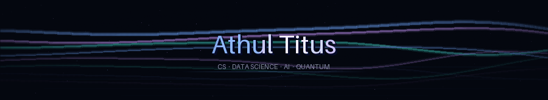

<div align="center">
  
</div>

<div align="center">
  
</div>

<br/>

<table>
<tr>
<td valign="top" width="55%">

```python
class AthulTitus:
    name     = "Athul Titus"
    location = "Thiruvananthapuram, Kerala, IN"
    degree   = "B.Tech CS (Data Science) — MACE, KTU"
    github   = "github.com/Athul-Titus"
    email    = "athultitus2027@gmail.com"

    stack = [
        "Python", "React", "FastAPI",
        "SQL", "R", "Flask",
        "Qiskit", "HTML/CSS"
    ]

    currently_learning = [
        "Agentic AI & Multi-Agent Systems",
        "Quantum Key Distribution (BB84)",
        "Large Language Model Integration",
        "PySpark & Power BI"
    ]

    def motto(self):
        return "Build it. Break it. Learn. Repeat."
```

</td>
<td valign="top" width="45%">

</td>
</tr>
</table>

---

## 🛠️ Tech Stack

**Languages**


**Frameworks & Libraries**


**Cloud & DevOps**


**Databases & Tools**


---

## 📊 GitHub Stats

<div align="center">
  <a href="https://github.com/Athul-Titus">
    
  </a>
  <a href="https://github.com/Athul-Titus">
    
  </a>
</div>

---

## 🔥 Streak Stats

<div align="center">
  
</div>

---

## 📈 Activity Graph

<div align="center">
  
</div>

---

## 🏆 Trophy Wall

<div align="center">
  
</div>

---

## 💼 Experience

<details>
<summary><strong>IEEE MACE Student Branch</strong> — Program & Technical Team Member &nbsp;|&nbsp; Feb 2025 – Present &nbsp;|&nbsp; Kothamangalam, Kerala</summary>

>   

- Contributed to technical planning and execution of chapter events, workshops, and hackathons.
- Served as Logistics Team member for **.hack()** — MACE's flagship hackathon event.
- Collaborated on cross-team coordination ensuring smooth event operations.

</details>

<details>
<summary><strong>GDG On Campus MACE</strong> — Logistics & Hospitality Lead &nbsp;|&nbsp; Feb 2025 – Present &nbsp;|&nbsp; Kothamangalam, Kerala</summary>

>  

- Led logistics and hospitality operations for **Lumora (Designathon)** — a campus-wide design competition.
- Managed attendee coordination, venue setup, and on-ground team supervision.

</details>

<details>
<summary><strong>AISA MACE (Space Club)</strong> — Organising Team Member &nbsp;|&nbsp; June 2025 – Present &nbsp;|&nbsp; Kothamangalam, Kerala</summary>

> 

- Active organising member for space science outreach and awareness events at MACE.

</details>

<details>
<summary><strong>Keltron Knowledge Centre</strong> — Intern (Web Development / Python / Django) &nbsp;|&nbsp; June 2026 &nbsp;|&nbsp; Kerala</summary>

>   

- Completed internship focused on web development using Python and Django framework.
- Applied backend development skills in a professional government-affiliated technology environment.

</details>

---

## 🚀 Featured Projects

<div align="center">

| Project | Stack | Highlights |
|:--------|:------|:-----------|
| [**⚽ KickStats — FIFA World Cup 2026 Predictor**](https://github.com/Athul-Titus/WorldCup_Predictor) &nbsp;[](https://worldcup-predictor-athul.streamlit.app/) | Python · XGBoost · Streamlit · Pandas · Plotly · Transfermarkt | ML-powered match & lineup predictor trained on 100+ yrs of international football; 55% accuracy (vs 33% random baseline); tactical lineup simulator with WC 2026 squads; player scout with EA FC 25 ratings; K-Means player archetypes; deployed on Streamlit Cloud |
| [**🤖 Cymonic — AI Talent Engine**](https://github.com/Athul-Titus/Talent-Search) &nbsp;[](https://talent-search-eight.vercel.app/dashboard) | React · FastAPI · NVIDIA NIM · Llama 3 (8B & 70B) · Vercel · Render | Replaced keyword-ATS with semantic LLM scoring; multi-format resume ingestion (PDF/DOCX/Images) with OCR; real-time SSE streaming; anti-fraud credibility detector; deployed full-stack |
| [**⚛️ BB84 QKD Simulator**](https://github.com/Athul-Titus/bb84_new) | TypeScript · Python · Qiskit · React · Flask · Cryptography | End-to-end quantum key distribution with Recursive BB84, rolling bias, Cascade error reconciliation; secure P2P messaging over LAN; smart abort classification |
| [**🔬 Microplastic Analyzer**](https://github.com/Athul-Titus/microplastic-analyser) | Python · K-Means · Apriori · Data Mining | Analyzed microplastic contamination in food products; K-Means clustering on contamination profiles; Apriori association rule mining for pattern discovery |

</div>

---

## 🏅 Achievements

<div align="center">

| | Achievement | Details |
|:---:|:------------|:--------|
| 🏛️ | **IEEE MACE SB Executive Committee** | Technical team — organizing & executing chapter events |
| 📜 | **NPTEL Certification — IoT** | Jul–Oct 2024, IIT-backed program |
| 🧠 | **Prompt Engineering Certified** | AccelerateX, Nov 2024 |
| 🐍 | **Python Certified** | MashupStack, Jun 2025 |
| 🔭 | **AISA Space Club Organiser** | MACE's astronomy & space science initiative |
| 🎨 | **Lumora Designathon Lead** | Logistics & Hospitality Lead, GDG On Campus MACE |

</div>

---

## 🎓 Education & Currently Learning

<div align="center">

| Degree | Institution | Year | Score |
|:-------|:------------|:-----|:------|
| B.Tech — Computer Science & Engineering (Data Science) | Mar Athanasius College of Engineering, Kothamangalam (KTU) | 2023 – 2027 | 3rd Year |

</div>

<br/>

```
🤖 Agentic AI          →  Multi-Agent Systems, Tool-Calling, LLM Orchestration
⚛️ Quantum Computing   →  BB84 QKD, Qiskit Runtime, E91 Protocol, PNS Attack Modeling
📊 Data Analytics      →  Power BI, PySpark, Dataiku, LLM-powered Analytics
🌐 Full-Stack Dev      →  FastAPI, React, Django, SSE Streaming
🔐 Cryptography        →  AES-256, PBKDF2, HMAC, Quantum-Safe Protocols
```

---

<div align="center">
  
  &nbsp;
  <a href="mailto:athultitus2027@gmail.com">
    
  </a>
  &nbsp;
  <a href="https://www.linkedin.com/in/athultitus/">
    
  </a>
  &nbsp;
  <a href="https://github.com/Athul-Titus">
    
  </a>
</div>

<br/>


<div align="center">
  
</div>
